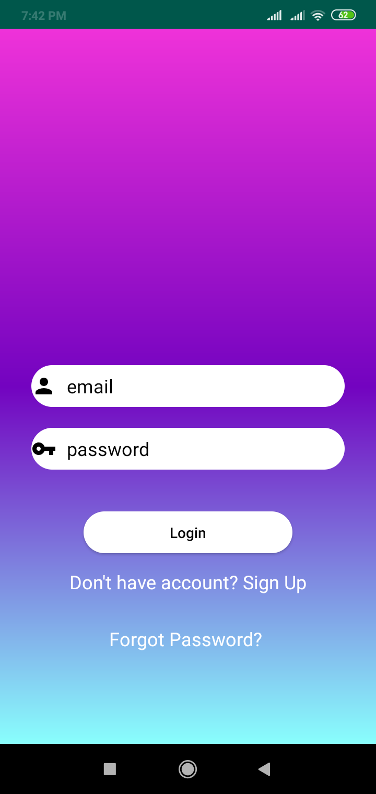
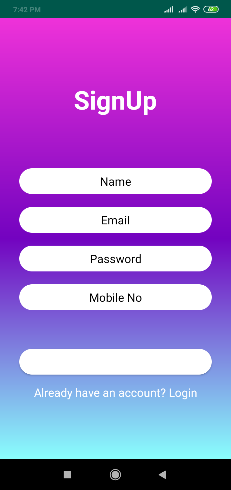
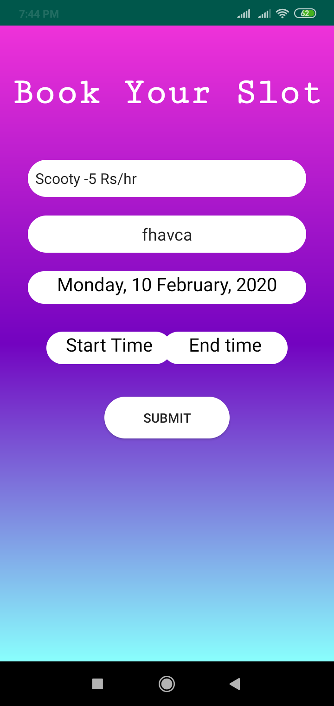
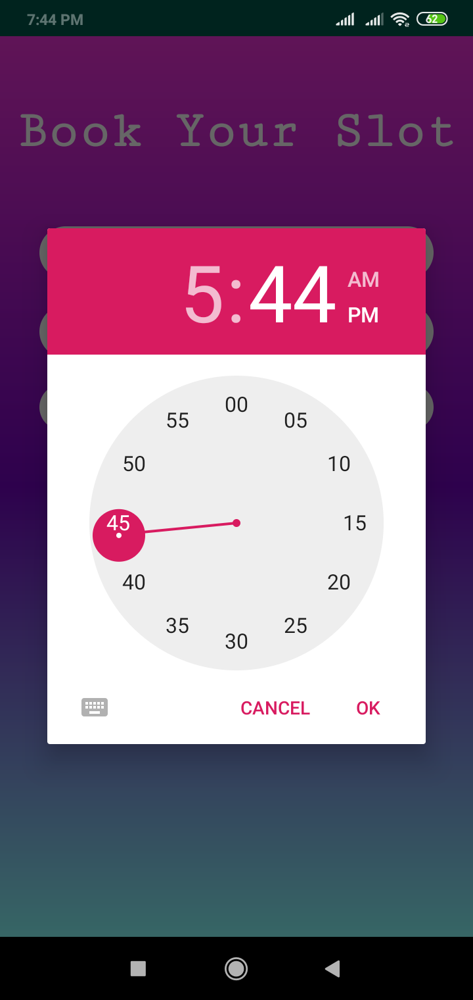
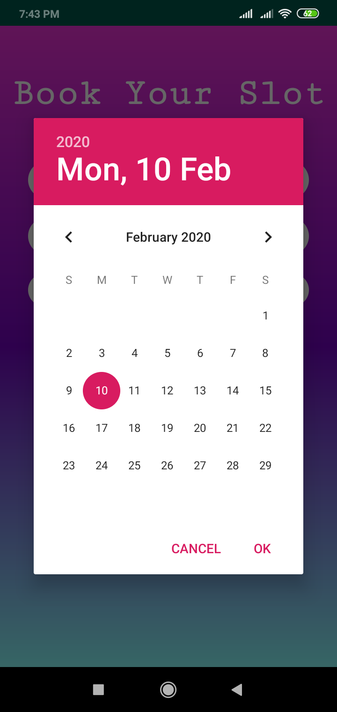
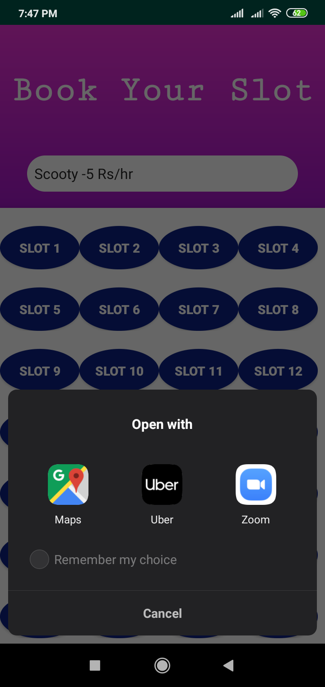

# ParkingApp
This application is a solution to a bigger problem of parking. In India, every second person is having a vehicle but there is no space for parking. So this application will help you to find a slot for parking.

# Android Application
Able to find a parking lot for your vehicle, by taking vehicle information and on which date you want to park and for how much time you want to park your vehicle. 

